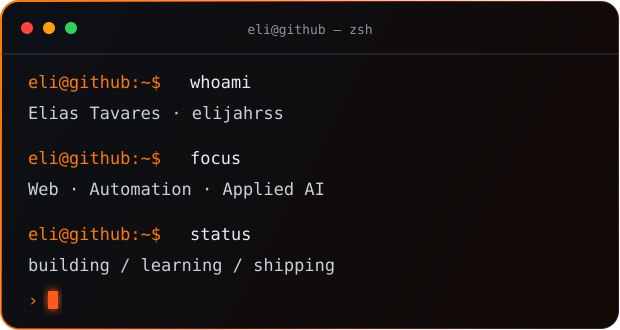

  

 

  
  

 

<table>
  <tr>
    <td width="54%" valign="top">
      <h2>Olá — I'm Elias.</h2>
      

        I'm a developer in progress from <strong>Salvador, Bahia, Brazil</strong>, turning curiosity into interfaces, automations and AI-powered experiments.
      

      

        I care about building things that are useful, expressive and easy to understand. My current mission is simple: strengthen the fundamentals, ship real projects and earn my first professional opportunity in tech.
      

      

        <strong>Current direction:</strong> web development, automation, applied AI and Lua/Luau.
      

    </td>
    <td width="46%" valign="top">
      
    </td>
  </tr>
</table>

## What I'm building

- **Web experiences** with responsive layouts, visual identity and purposeful motion.
- **Automation prototypes** that remove repetitive work and turn ideas into repeatable flows.
- **AI experiments** connecting models, tools and practical applications.
- **A strong engineering foundation** — clean code, Git, APIs, debugging and documentation.

## Toolbox

  <strong>Working with</strong>  
  

  <strong>Currently learning</strong>  
  

## Selected work

<table>
  <tr>
    <td width="50%" valign="top">
      <h3><a href="https://github.com/elijahrss/Cipriano">Grimório Noturno</a></h3>
      
A multi-page cultural guide with an immersive editorial identity, responsive navigation and rich long-form content.

      
<code>HTML</code> <code>CSS</code> <code>JavaScript</code>

    </td>
    <td width="50%" valign="top">
      <h3><a href="https://github.com/elijahrss/jess">Interactive Web Letter</a></h3>
      
A small creative front-end experience built around animation, typography and an interactive reveal.

      
<code>HTML</code> <code>CSS Animation</code> <code>JavaScript</code>

    </td>
  </tr>
  <tr>
    <td width="50%" valign="top">
      <h3><a href="https://github.com/elijahrss/elijahrss">Profile System</a></h3>
      
The visual system behind this profile: original animated SVGs, a focused content hierarchy and automated contribution artwork.

      
<code>SVG</code> <code>Markdown</code> <code>GitHub Actions</code>

    </td>
    <td width="50%" valign="top">
      <h3>Next build loading...</h3>
      
I'm refining new automation and AI projects before publishing them with proper documentation and demos.

      
<code>BUILDING</code> <code>LEARNING</code> <code>SHIPPING</code>

    </td>
  </tr>
</table>

## GitHub pulse

  
  

 

  

## Contribution trail

<picture>
  <source media="(prefers-color-scheme: dark)" srcset="https://raw.githubusercontent.com/elijahrss/elijahrss/output/github-contribution-grid-snake-dark.svg" />
  <source media="(prefers-color-scheme: light)" srcset="https://raw.githubusercontent.com/elijahrss/elijahrss/output/github-contribution-grid-snake.svg" />
  
</picture>

---

  <strong>Curiosity starts the engine. Consistency gets it across the finish line.</strong>
   
  Open to learning, collaboration and first opportunities in technology.

